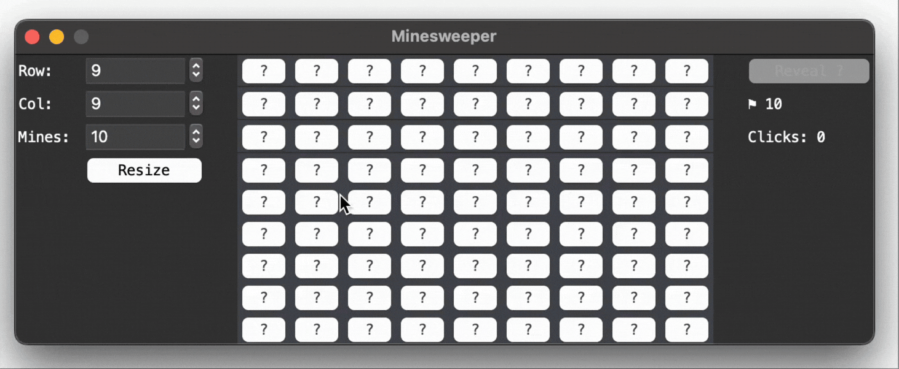
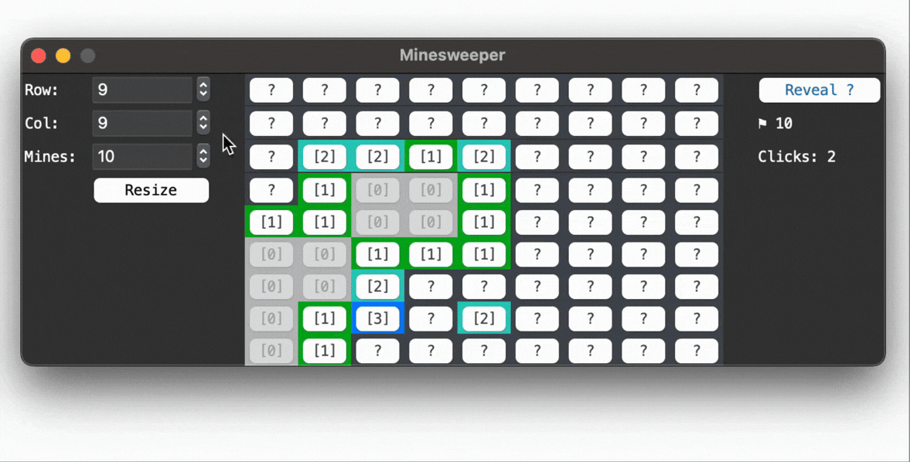

# Minesweeper built using tkinter

### Main Features:
- Standard revealing & flagging
- First-click guaranteed to reveal a tile with 0 adjacent mines
- Chording shortcut
- Dynamic grid size & mine count

## How to play:
- Select a tile to reveal a tile. This one is guaranteed to be safe :)
- Mode swapping: Press the button on the right to switch between "Reveal Mode" and "Flag Mode". The default is "Reveal Mode".
- Flagging: Mark the location of mines when in "Flag Mode".
- Chording: In either mode, click on numbered tile to reveal adjacent non-flagged tiles. This only works if the correct number of flags has been placed.
  - If flags are misplaced, the mines will be triggered and the game will be lost. Be careful!
- Changing grid size: On the left, select the desired grid size and mine count. Then, click "Resize" to update the grid, note that any current progress will be lost.
  - The minimum size is 5 x 5 and the maximum size is 30 x 25.
  - The number of mines ≤ (grid size - 9).

## Main Logic
- Flood fill (DFS): If the to-be-revealed tile has no adjacent mines, reveal the adjacent tiles as well. Repeat until no more such tiles is found.
- First-click guaranteed: Since the number of mines ≤ (grid size - 9), there is alway at least 9 safe tiles. If the first tile has a mine or has mine(s) adjacent to it, move them to other safe tiles. This ensures the first click reveals at least 8 numbered tiles, meaning the player is less likely to get stuck.
- Dynamic grid size: Destroy existing tiles' widgets to free up the memory before creating new ones. The grid size constraint is to ensure smooth performance.
